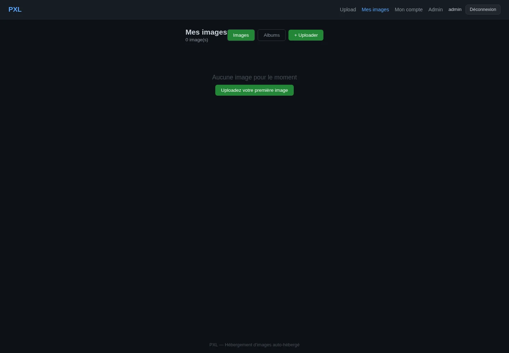
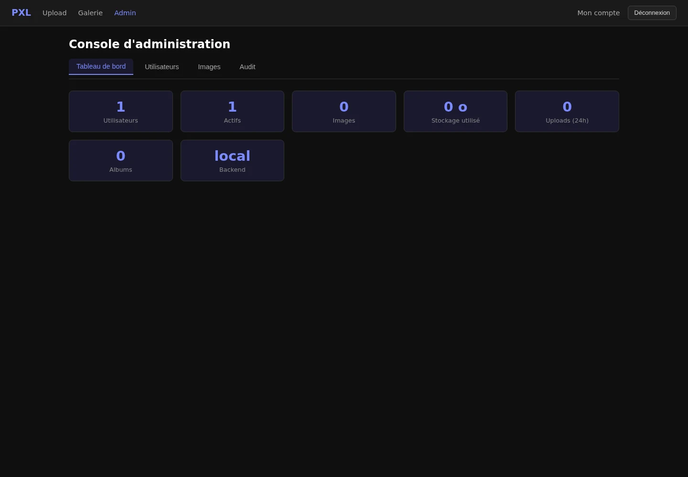

<p align="center">
  
</p>

# PXL

PXL is a self-hosted image hosting service with a web interface and HTTP API.
It stores metadata in PostgreSQL and image objects on a local volume or an
S3-compatible service.

## Features

- Browser uploads by file selection, drag and drop, paste, batches, or folders
- JPEG, PNG, GIF, and WebP validation using content detection and image decoding
- Direct image and thumbnail URLs with ETags, byte ranges, and cache controls
- Accounts, short-lived JWTs, rotating refresh tokens, API keys, and quotas
- Public or private albums and automatic albums for authenticated batch uploads
- Owner or deletion-token authorization; the token is returned only at creation
- Admin pages and API endpoints for users, images, statistics, and audit events
- Local filesystem and S3-compatible storage backends
- Prometheus metrics and structured logging

## Interface

These screenshots come from an isolated application stack populated only with
synthetic credentials and empty demo storage.





## Docker Installation

Docker Engine, Docker Compose v2, Git, and OpenSSL are required. The supported
installation path builds the checked-out source with Docker Compose.

```bash
git clone https://github.com/HeartBtz/pxl.git
cd pxl
cp .env.example .env
openssl rand -hex 24   # use as PXL_DB_PASS
openssl rand -hex 32   # use as PXL_JWT_SECRET
openssl rand -hex 16   # use as PXL_ADMIN_PASS
docker compose config --quiet
docker compose up --build --detach
docker compose ps
curl --fail http://localhost:8080/health
```

Set the three generated values in `.env` before validating the configuration.
The initial administrator is created from `PXL_ADMIN_USERNAME` and
`PXL_ADMIN_PASS`. The password is ignored after that user exists. Anonymous
uploads and public registration are disabled by default.

Alternatively, `./install.sh` creates a mode-0600 `.env` with generated secrets,
validates Compose, and runs the same build and start operation. It does not
install packages or change host configuration. Use `./install.sh --check` to
stop after validation.

PXL binds to `127.0.0.1:8080` by default. Keep that binding behind an HTTPS
reverse proxy, or deliberately change `PXL_BIND_ADDRESS`. Set `PXL_BASE_URL` to
the exact public origin so generated links and browser origin checks are correct.

## Configuration

`.env.example` is the complete list of variables consumed by
`docker-compose.yml`. Important groups are:

| Purpose | Variables |
| --- | --- |
| HTTP | `PXL_BIND_ADDRESS`, `PXL_PORT`, `PXL_BASE_URL` |
| Bootstrap | `PXL_ADMIN_USERNAME`, `PXL_ADMIN_PASS` |
| Secrets | `PXL_DB_PASS`, `PXL_JWT_SECRET` |
| Access | `PXL_ALLOW_ANONYMOUS`, `PXL_ALLOW_REGISTRATION` |
| Storage | `PXL_STORAGE_BACKEND`, `PXL_STORAGE_S3_*` |
| Uploads | `PXL_MAX_UPLOAD_SIZE`, `PXL_MAX_UPLOAD_FILES`, `PXL_MAX_PIXELS`, `PXL_UPLOAD_*` |
| Security | `PXL_TRUSTED_PROXIES`, `PXL_CORS_ORIGIN`, `PXL_*RATE_LIMIT*` |
| Runtime | `PXL_THUMB_*`, `PXL_METRICS_*`, `PXL_LOG_*` |

For S3 storage, set the backend to `s3` and provide endpoint, bucket, access key,
and secret key values. `PXL_STORAGE_S3_FORCE_PATH_STYLE=true` is commonly needed
for MinIO. The local image volume remains mounted but is unused by image storage
when S3 is selected.

Application defaults and additional low-level variables are defined in
[`internal/config/config.go`](internal/config/config.go). Compose intentionally
fixes database connectivity, migration paths, and writable data paths to match
the bundled containers.

## API Overview

All JSON API routes are under `/api/v1`.

| Method and route | Purpose | Access |
| --- | --- | --- |
| `POST /auth/login` | Issue access and refresh tokens | Public |
| `POST /auth/register` | Register an account | Public only when enabled |
| `POST /auth/refresh` | Rotate a refresh token | Refresh token |
| `GET /auth/me` | Read the current profile | JWT or API key |
| `POST /upload` | Upload one or more `file` parts | Authenticated by default |
| `GET /images/{shortID}` | Read visible image metadata | Public or owner |
| `DELETE /images/{shortID}` | Delete an image | Owner or `X-Delete-Token` |
| `/albums` and `/albums/{shortID}` | Create, list, read, and manage albums | Mixed; mutations require auth |
| `/admin/*` | Manage users/images and read audit data | Admin browser session |

Login and upload example:

```bash
TOKEN="$(curl --fail --silent http://localhost:8080/api/v1/auth/login \
  -H 'Content-Type: application/json' \
  --data '{"username":"admin","password":"YOUR_ADMIN_PASSWORD"}' | jq -r .token)"

curl --fail http://localhost:8080/api/v1/upload \
  -H "Authorization: Bearer ${TOKEN}" \
  -F 'file=@photo.jpg'
```

Successful uploads return view, direct, thumbnail, and delete URLs plus a
deletion token. Send that token in the `X-Delete-Token` header; do not put it in
a query string. Multi-file requests accept at most `PXL_MAX_UPLOAD_FILES` parts
and create an album for authenticated users unless `?auto_album=false` is used.

Web routes include `/`, `/login`, `/gallery`, `/account`, `/admin`, `/v/{id}`,
and `/a/{id}`. Raw images and thumbnails use `/i/{id}` and `/t/{id}`. `/health`
checks database connectivity.

## Source Development

Requirements are Go 1.26.7, PostgreSQL 16, and Node.js 22 or later for the
browser-side test files. Create a PostgreSQL database and user, then provide at
least these variables:

```bash
export PXL_DB_HOST=localhost
export PXL_DB_NAME=pxl
export PXL_DB_USER=pxl
export PXL_DB_PASS='development-only-password'
export PXL_DB_SSLMODE=disable
export PXL_AUTH_JWT_SECRET="$(openssl rand -hex 32)"
export PXL_AUTH_ADMIN_PASSWORD='development-admin-password'
export PXL_AUTH_ALLOW_ANONYMOUS=false
export PXL_AUTH_ALLOW_REGISTRATION=false

go run ./cmd/server
```

Migrations run automatically at startup. Common checks are:

```bash
gofmt -w .
go test -race ./...
go vet ./...
node --test web/*.test.cjs
docker compose build
```

Some repository integration tests require `PXL_TEST_DATABASE_URL` and skip when
it is absent.

## Updates And Backups

Before updating, back up PostgreSQL, image data, and `.env` together. For local
storage, a maintenance-window backup can be created as follows:

```bash
mkdir -p backup
docker compose stop pxl
docker compose exec -T postgres pg_dump -U pxl -d pxl > backup/pxl.sql
docker compose run --rm --no-deps --entrypoint tar pxl \
  -czf - -C /app/data . > backup/pxl-data.tar.gz
cp .env backup/pxl.env
docker compose start pxl
```

Protect backups because `pxl.env` contains credentials. With S3 storage, back up
the bucket using the storage provider's versioned backup mechanism instead of
the local data archive. Test restoration on an isolated stack; the presence of
backup files alone does not prove recoverability.

After a verified backup:

```bash
git pull --ff-only
docker compose up --build --detach
docker compose ps
curl --fail http://localhost:8080/health
```

Review release notes and configuration changes before updating. Do not use
`docker compose down --volumes` unless permanent data deletion is intended.

## Security

- Use HTTPS and keep the default loopback binding when a reverse proxy is used.
- Keep anonymous uploads and registration disabled unless they are intentional.
- Use unique secrets, restrict `.env`, and rotate exposed credentials.
- Set only exact trusted proxy addresses/CIDRs and one exact CORS origin.
- Treat direct URLs as public capabilities unless the image is marked private.
- The current upload API does not expose general image privacy, expiry, or
  burn-after-view options; do not assume those model fields protect new uploads.

See [SECURITY.md](SECURITY.md) for vulnerability reporting and the supported
security-update policy.

## Contributing

See [CONTRIBUTING.md](CONTRIBUTING.md). By contributing, you agree that your
changes are licensed under this repository's Apache License 2.0.

## License

Licensed under the [Apache License 2.0](LICENSE).
